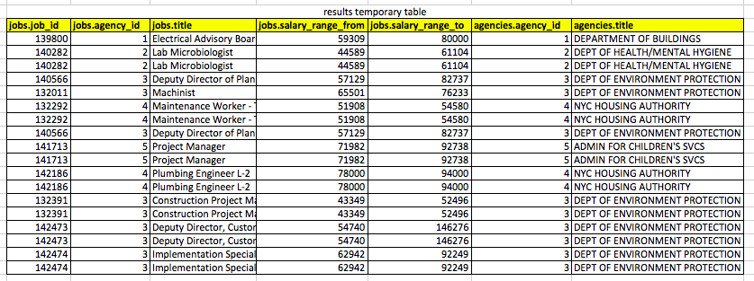

# SQLite Inner Joins

The `JOIN` keyword is used in an SQL statement to query data from two tables based on fields that the two tables share in common. Such connections between fields in multiple tables are some of the insights that often become apparent during the database design phase of a project, through the processes of **data normalization** and **entity relationship diagramming**.

## Types of joins

There are several varieties of joins in relational databases:

- Inner joins
- Outer joins
  - Left joins
  - Right joins (not supported by SQLite)

Usually all of these joins are used to merge data from one table with related data from a different table. However, any of these joins can also be **reflexive**, meaning a single table can be joined with another instance of the same table.

## Temporary tables

Joins are used to combine the data from two tables, with the result being a new, temporary table. The goal is to extract meaningful data from the resulting temporary table.

## Referential integrity

Inner joins are queries that return only those rows from two tables where there is at least one field in common in each table.

- **inner joins** ensure referential integrity, by definition. They don't return rows from one table where there is no related data in the other table.
- **left joins** do not ensure referential integrity, and may return data from one of the tables where there are no related data in the other table as well as results where there is related data.

## Example of related tables

For example, take these tables, scraped together from [NYC Jobs data available from the NYC Open Data project](https://data.cityofnewyork.us/Business/NYC-Jobs/kpav-sd4t).

A table representing job listings at NYC government agencies. Note the agency_id field as a foreign key:


A table representing NYC government agencies. Note the agency_id field as the primary key:


### Explicit syntax

An inner join query that returns all rows from both tables where the agency_id fields match might look as follows. The syntax in this particular example is an **explicit inner join**, since the words `INNER JOIN` are written explicitly:

```sql
SELECT * FROM jobs INNER JOIN agencies ON jobs.agency_id=agencies.agency_id;
```

### Implicit syntax

The following syntax, which functions identically, is called an **implicit inner join**, because the words `INNER JOIN` are not mentioned anywhere explicitly:

```sql
SELECT * FROM jobs, agencies WHERE jobs.agency_id=agencies.agency_id;
```

### Results

The resultant temporary table returned by MySQL in response to either of the above queries would look like this:



### Aliases

Sometimes it's helpful to use aliases for table names in order to keep the syntax short.

Take the following verbose implicit inner join query as an example:

```sql
SELECT jobs.title, jobs.salary_range_from, jobs.salary_range_to, agencies.title FROM jobs, agencies WHERE jobs.agency_id=agencies.agency_id;
```

Using aliases for the table names, this could be written more simply as the following:

```sql
SELECT j.title, j.salary_range_from, j.salary_range_to, a.title FROM jobs j, agencies a WHERE j.agency_id=a.agency_id;
```

Similarly, an explicit inner join can use aliases:

```sql
SELECT j.title, j.salary_range_from, j.salary_range_to, a.title FROM jobs j INNER JOIN agencies a ON j.agency_id=a.agency_id;
```

Implicit inner joins with aliases require the least typing.

## Scraping and munging data to be used in multiple related tables

The original NYC Jobs data file mentioned in the examples above is
available as a [single CSV
file](https://data.cityofnewyork.us/api/views/kpav-sd4t/rows.csv?accessType=DOWNLOAD&bom=true).
The jobs and agencies data are not separated into two tables as we would
like them. So, in order to prepare the data to be imported into two
separate relational database tables, it obviously requires munging and
separating of agency data from jobs data.

### Step 1

Open the file in Excel and delete the columns we are not interested in.
In this example, we delete everything except the following columns:

- Job ID
- Agency
- Business Title
- Salary Range From
- Salary Range To

### Step 2

Run the following Python script (download it [here](./example_data/munge_nyc_jobs.py)) to separate the data into two data files: one for agencies and one for jobs. This script will ultimately create two new text files, `jobs_data.csv` and `agencies_data.csv`, with the scrubbed data in them..

```python
#PART 1: OPEN ORIGINAL DATA FILE

import codecs
f = codecs.open("nyc_jobs.csv", mode='r', encoding='utf-8')

#loop through each line in the file
firstLine = True #flag/sentinel

#make a blank dictionary that will hold the agency names and ids
agencies = {}

#keep track of numbers we've used before as ids
id_counter = 1

all_lines = [] #this will store all lines of data as we want to save it


#PART 2: MUNGE DATA FROM FILE

for line in f:
    #check whether flag is true
    if firstLine == True:
        #if so, set it to false, and skip to the next line
        firstLine = False
        continue

    #at this point, we can assume we are at a line of data
    line_data = line.split(",")
    agency_name = line_data[1]

    #see whether this agency has already got an id
    if agency_name in agencies.keys():
        #if it does, then figure out it's id, which is the key
        agency_id = agencies[agency_name]

    else:
        agency_id = str(id_counter)
        id_counter = id_counter + 1
        agencies[agency_name] = agency_id

    # at this point, our dictionary has all the agencies we've found so  far...
    # and we know the id and name in the current row of the file

    # overwrite the agency name in the second field in the line with the id
    line_data[1] = agency_id

    #add this data to the all_lines list
    all_lines.append(line_data)


#PART 3: WRITE NEW JOBS DATA FILE

#create a new text file with just the data for the jobs table
jobs_file = codecs.open("jobs_data.txt", mode='w', encoding='utf-8')

for line in all_lines:
    line_text_with_commas = ",".join(line)
    #print("printing line...")
    jobs_file.write(line_text_with_commas)

jobs_file.close() #close the file when done


#PART 4: WRITE NEW AGENCIES DATA FILE

#create a new text file with just the agencies data
agencies_file = codecs.open("agencies_data.txt", mode='w',encoding='utf-8')

for item in agencies.items():
    line_text_with_commas = str(item[0]) + "," + str(item[1])
    agencies_file.write(line_text_with_commas + "\n")

agencies_file.close() #close the file
```

### Step 3

Create two relational database tables to hold these two sets of
data.

```sql
CREATE TABLE jobs (
    id INTEGER PRIMARY KEY,
    job_id INTEGER,
    agency_id INTEGER,
    title TEXT,
    salary_range_from INTEGER,
    salary_range_to INTEGER,
    created DATETIME DEFAULT CURRENT_TIMESTAMP
);
```

```sql
CREATE TABLE agencies (
	 id INTEGER PRIMARY KEY,
	 agency_id INTEGER,
	 title TEXT,
	 created DATETIME DEFAULT CURRENT_TIMESTAMP
);
```

### Step 4

Import the data from the two files into the two tables.

```sql
# switch to CSV mode
.mode csv

# create a temporary table with fields that exactly match the CSV
CREATE TABLE temp_table (
    job_id INTEGER,
    agency_id INTEGER,
    title TEXT,
    salary_range_from INTEGER,
    salary_range_to INTEGER
);

# import the CSV file into the temporary table
.import ./jobs_data.csv temp_table

# copy the data into the permanent table
INSERT INTO jobs (job_id, agency_id, title, salary_range_from, salary_range_to) SELECT * FROM temp_table;

# drop the temporary table
DROP TABLE temp_table;
```

```sql
# switch to CSV mode
.mode csv

# create a temporary table with fields that exactly match the CSV
CREATE TABLE temp_table (
	 agency_id INTEGER,
	 title TEXT
);

# import the CSV file into the temporary table
.import ./agencies_data.csv temp_table

# copy the data into the permanent table
INSERT INTO agencies (agency_id, title) SELECT * FROM temp_table;

# drop the temporary table
DROP TABLE temp_table;
```
